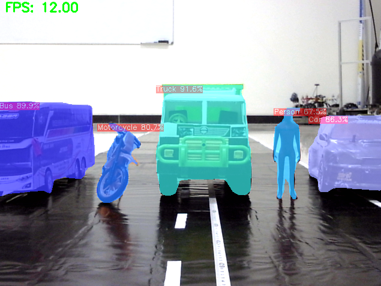
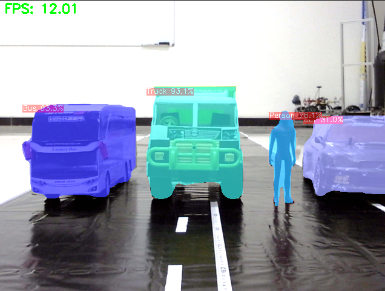

# Object Detection & Segmentation ROS


## Table of Contents
- [Features](#-features)
- [Requirements](#-requirements)
- [Documentation](#-documentation)

## Description
This project implements **object detection and segmentation** using the **YOLOv8** model integrated with **ROS Noetic**. It is designed to provide real-time object recognition and segmentation capabilities for robotics applications, leveraging ROS topics for data communication.

## ✨ Features
- Real-time **object detection and segmentation** using YOLOv8.
- Full integration with **ROS Noetic** for seamless robotic applications.
- Publishes detection results as `sensor_msgs/Image` messages.
- Compatible with USB webcams or other ROS-supported cameras.
- Modular structure with dedicated nodes:
  - **camera_access**: Captures and publishes camera frames.
  - **yolov8_seg_ros**: Performs YOLOv8 inference for object detection and segmentation.

## ✅ Requirements
Before setting up this project, ensure you have the following installed:
- **Ubuntu 20.04** with **ROS Noetic**
- **Python 3.8+**
- **OpenCV** (for image processing)
- **Ultralytics YOLOv8**
- ROS packages:
  - `cv_bridge`
  - `image_transport`

Install YOLOv8 with:
```bash
pip install ultralytics
```

## 📚 Documentation



## 🙏 Thank You
Thank you for visiting this repository! If this project is useful, don't forget to give it a ⭐ so that more people can find it.

Created with 💻 by [Ady Saputra](https://github.com/adysaptr
